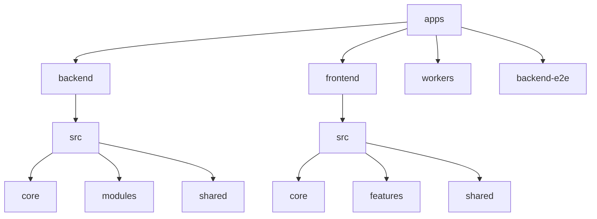

# Project Structure Guide

## Directory Structure



```text
fresh-expense/
├── apps/
│   ├── backend/           # NestJS backend application
│   │   ├── src/
│   │   │   ├── core/     # Core application code
│   │   │   │   ├── config/      # Configuration files
│   │   │   │   ├── database/    # Database setup and models
│   │   │   │   └── utils/       # Core utilities
│   │   │   ├── modules/  # Feature modules
│   │   │   │   ├── auth/       # Authentication module
│   │   │   │   ├── receipts/   # Receipt processing
│   │   │   │   └── expenses/   # Expense management
│   │   │   └── shared/   # Shared resources
│   │   │       ├── decorators/ # Custom decorators
│   │   │       ├── interceptors/ # HTTP interceptors
│   │   │       ├── middleware/  # Express middleware
│   │   │       ├── types/      # Shared types
│   │   │       └── utils/      # Shared utilities
│   │   └── test/         # Backend tests
│   ├── frontend/         # React frontend application
│   │   ├── src/
│   │   │   ├── core/    # Core application code
│   │   │   │   ├── api/        # API client setup
│   │   │   │   ├── config/     # Configuration
│   │   │   │   ├── router/     # Routing setup
│   │   │   │   ├── theme/      # Theme configuration
│   │   │   │   └── utils/      # Core utilities
│   │   │   ├── features/ # Feature modules
│   │   │   │   ├── auth/      # Authentication
│   │   │   │   ├── receipts/  # Receipt management
│   │   │   │   └── expenses/  # Expense tracking
│   │   │   └── shared/  # Shared resources
│   │   │       ├── components/ # Reusable components
│   │   │       ├── hooks/     # Custom hooks
│   │   │       ├── types/     # Shared types
│   │   │       └── utils/     # Shared utilities
│   │   └── test/        # Frontend tests
│   ├── workers/         # Cloudflare Workers
│   └── backend-e2e/     # End-to-end tests
├── packages/
│   ├── types/          # Shared TypeScript types
│   └── utils/          # Shared utility functions
└── tools/              # Build and development tools
```

## Naming Conventions

### Files

- Use kebab-case for file names: `user-profile.component.ts`
- Use PascalCase for React components: `UserProfile.tsx`
- Use camelCase for utility files: `formatDate.ts`
- Use .tsx for React components
- Use .ts for TypeScript files without JSX

### Directories

- Use kebab-case for directory names
- Group related files in directories
- Keep directory names singular (e.g., `model` not `models`)

### Code

- Use PascalCase for:
  - Class names
  - Interface names
  - Type names
  - React components
- Use camelCase for:
  - Variables
  - Functions
  - Methods
  - Properties
- Use UPPER_SNAKE_CASE for:
  - Constants
  - Enums

## File Organization

### Backend

- Core functionality in `core/` directory
- Feature modules in `modules/` directory
- Shared resources in `shared/` directory
- One module per feature
- Include related files in module directory

### Frontend

- Core functionality in `core/` directory
- Feature modules in `features/` directory
- Shared resources in `shared/` directory
- One feature per directory
- Include related components, hooks, and types

### Tests

- Place test files next to the code they test
- Use `.spec.ts` or `.test.ts` suffix
- Group related tests in describe blocks
- Follow the same directory structure as source code

## Import/Export Rules

- Use named exports for utilities and constants
- Use default exports for React components
- Group imports by type:
  1. External dependencies
  2. Internal modules
  3. Relative imports
- Use absolute imports with @/ prefix for src directory

## Documentation

- Use JSDoc comments for public APIs
- Include type information in comments
- Document complex business logic
- Keep README files up to date

## Git

- Use meaningful commit messages
- Follow conventional commits
- Keep commits focused and atomic
- Use feature branches for new development
