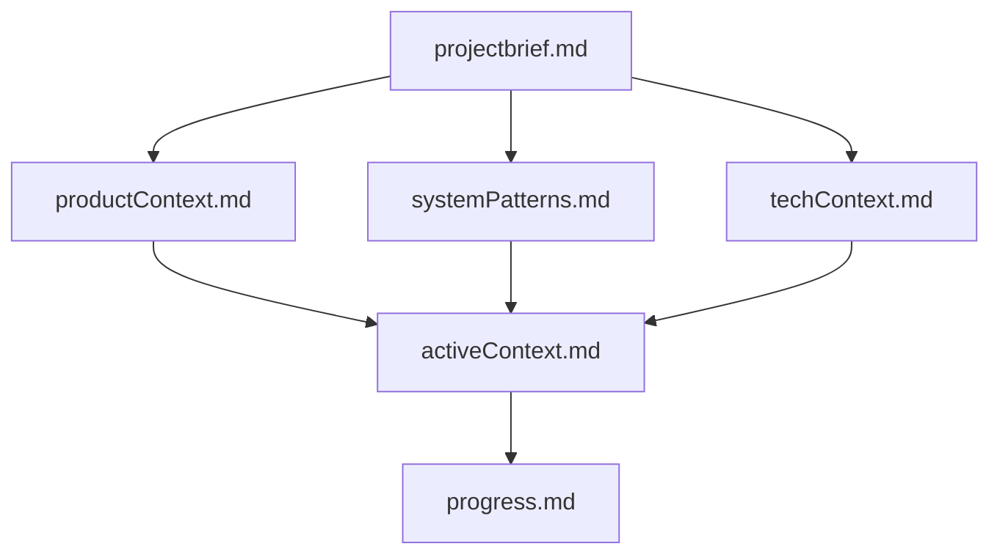

# Project Structure Guide

## Directory Structure



```text
fresh-expense/
├── apps/
│   ├── backend/           # NestJS backend application
│   │   ├── src/
│   │   │   ├── app/      # Main application code
│   │   │   │   ├── models/      # Database models
│   │   │   │   ├── controllers/ # API controllers
│   │   │   │   ├── services/    # Business logic
│   │   │   │   ├── dto/        # Data Transfer Objects
│   │   │   │   ├── interfaces/ # TypeScript interfaces
│   │   │   │   └── utils/      # Utility functions
│   │   │   └── main.ts
│   │   └── test/         # Backend tests
│   └── frontend/         # React frontend application
│       ├── src/
│       │   ├── components/  # Reusable UI components
│       │   ├── pages/      # Page components
│       │   ├── hooks/      # Custom React hooks
│       │   ├── store/      # State management
│       │   ├── utils/      # Utility functions
│       │   └── types/      # TypeScript types
│       └── test/          # Frontend tests
├── packages/
│   ├── types/            # Shared TypeScript types
│   └── utils/            # Shared utility functions
└── tools/                # Build and development tools
```

## Naming Conventions

### Files

- Use kebab-case for file names: `user-profile.component.ts`
- Use PascalCase for React components: `UserProfile.tsx`
- Use camelCase for utility files: `formatDate.ts`
- Use .tsx for React components
- Use .ts for TypeScript files without JSX

### Directories

- Use kebab-case for directory names
- Group related files in directories
- Keep directory names singular (e.g., `model` not `models`)

### Code

- Use PascalCase for:
  - Class names
  - Interface names
  - Type names
  - React components
- Use camelCase for:
  - Variables
  - Functions
  - Methods
  - Properties
- Use UPPER_SNAKE_CASE for:
  - Constants
  - Enums

## File Organization

### Models

- One model per file
- File name matches model name in kebab-case
- Include schema, types, and related interfaces in the same file

### Components

- One component per file
- Include related styles and tests in the same directory
- Use index.ts for barrel exports

### Services

- Group related functionality
- One service per file
- Include related interfaces and types

### Tests

- Place test files next to the code they test
- Use `.spec.ts` or `.test.ts` suffix
- Group related tests in describe blocks

## Import/Export Rules

- Use named exports for utilities and constants
- Use default exports for React components
- Group imports by type:
  1. External dependencies
  2. Internal modules
  3. Relative imports
- Use absolute imports with @/ prefix for src directory

## Documentation

- Use JSDoc comments for public APIs
- Include type information in comments
- Document complex business logic
- Keep README files up to date

## Git

- Use meaningful commit messages
- Follow conventional commits
- Keep commits focused and atomic
- Use feature branches for new development
