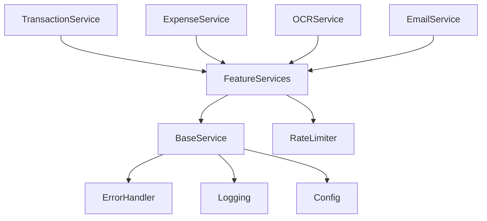

# System Documentation

## Executive Summary

The Expense Management System is a comprehensive solution for managing receipts, transactions, and financial data. The system is built using modern technologies and follows best practices for security, scalability, and maintainability.

### Key Features

1. Receipt Processing

   - OCR-based text extraction
   - Merchant matching
   - Transaction linking
   - Image storage and optimization

2. Financial Management

   - Transaction tracking
   - Expense categorization
   - Budget monitoring
   - Analytics and reporting

3. Integration Capabilities
   - Banking integration (Teller)
   - Google services (Photos, Drive)
   - Email processing
   - CSV import/export

### Technology Stack

1. Frontend

   - React
   - TypeScript
   - Tailwind CSS
   - Vite

2. Backend

   - NestJS
   - MongoDB
   - R2/S3 Storage
   - JWT Authentication

3. External Services
   - Hugging Face (OCR)
   - Tesseract.js (OCR)
   - Teller (Banking)
   - Google APIs

### Architecture Overview

1. Microservices Architecture

   - Service isolation
   - API Gateway
   - Event-driven communication

2. Data Management

   - Document database
   - File storage
   - Caching layer
   - Data validation

3. Security
   - JWT authentication
   - Role-based access
   - Rate limiting
   - Data encryption

### Development Practices

1. Code Quality

   - TypeScript
   - ESLint
   - Unit testing
   - Integration testing

2. CI/CD

   - Automated builds
   - Test automation
   - Docker containerization
   - Environment management

3. Documentation
   - API documentation
   - Code documentation
   - Architecture documentation
   - Deployment guides

## Receipt Processing System

### Overview

The receipt processing system is a comprehensive solution for handling, storing, and analyzing receipts. It consists of multiple services working together to provide receipt management functionality.

### Core Components

#### 1. R2Service (`apps/backend/src/services/r2/r2.service.ts`)

**Purpose**: Handles file storage and OCR processing for receipts.

**Key Features**:

- File upload to S3-compatible storage (R2)
- Thumbnail generation
- OCR processing using both Hugging Face and Tesseract
- Rate limiting for API calls
- Signed URL generation

**Configuration Requirements**:

- R2_REGION
- R2_ENDPOINT
- R2_ACCESS_KEY_ID
- R2_SECRET_ACCESS_KEY
- R2_BUCKET
- R2_PUBLIC_URL
- HUGGING_FACE_API_KEY

**Key Interfaces**:

```typescript
interface UploadResult {
  _id?: Types.ObjectId;
  key: string;
  url: string;
  thumbnailKey?: string;
  thumbnailUrl?: string;
  createdAt?: Date;
  updatedAt?: Date;
}

interface ReceiptData {
  _id?: Types.ObjectId;
  rawText: string;
  total?: number;
  date?: Date;
  merchantName?: string;
  items?: ReceiptItem[];
  metadata?: Record<string, any>;
  status?: 'pending' | 'processed' | 'failed';
  processingConfidence?: number;
  createdAt?: Date;
  updatedAt?: Date;
}
```

#### 2. ReceiptFinderService (`apps/backend/src/services/receipt/receipt-finder.service.ts`)

**Purpose**: Provides advanced receipt search and matching capabilities.

**Key Features**:

- Fuzzy text search
- Merchant matching
- Amount range filtering
- Date range filtering
- Category and tag filtering
- Similar receipt finding
- URL signing for images

**Key Interfaces**:

```typescript
interface ReceiptSearchOptions {
  userId: string;
  query?: string;
  merchant?: string;
  minAmount?: number;
  maxAmount?: number;
  startDate?: Date;
  endDate?: Date;
  categories?: string[];
  tags?: string[];
  source?: 'CSV' | 'EMAIL' | 'GOOGLE_PHOTOS' | 'MANUAL';
  fuzzyMatch?: boolean;
  limit?: number;
  offset?: number;
}

interface ReceiptMatchResult {
  receipt: ReceiptDocument;
  score: number;
  matchDetails: MatchScoreDetails;
}
```

### Module Structure

#### ReceiptFinderModule (`apps/backend/src/services/receipt/receipt-finder.module.ts`)

**Purpose**: NestJS module configuration for receipt finding functionality.

**Dependencies**:

- MongooseModule (Receipt Schema)
- R2Module

### Known Issues

1. Linter Error: Missing @expense/utils module
2. Potential undefined handling needed for R2 service URL generation

### Integration Points

1. MongoDB for receipt storage
2. R2/S3 for file storage
3. Hugging Face API for OCR
4. Tesseract.js as fallback OCR

### Security Considerations

1. Rate limiting implemented for Hugging Face API
2. Signed URLs for secure file access
3. User-scoped queries for data isolation

### Performance Optimizations

1. Thumbnail generation for faster image loading
2. Pagination support in search queries
3. Indexed text search capabilities
4. Caching opportunities for signed URLs (TODO)

## Service Architecture

### Core Services

#### Base Services

1. **BaseService** (`base.service.ts`)

   - Base class for service implementations
   - Common functionality and utilities

2. **ConfigService** (`config.service.ts`)

   - Application configuration management
   - Environment variable handling

3. **ErrorHandlerService** (`error-handler.service.ts`)

   - Centralized error handling
   - Error logging and formatting

4. **LoggingService** (`logging.service.ts`)

   - Application-wide logging
   - Log level management

5. **RateLimiterService** (`rate-limiter.service.ts`)

   - API rate limiting
   - Request throttling

6. **ServiceManagerService** (`service-manager.service.ts`)
   - Service lifecycle management
   - Service registration and discovery

### Feature Services

#### Data Processing

1. **OCR Service** (`ocr/`)

   - Optical Character Recognition
   - Text extraction from images

2. **PDF Service** (`pdf/`)

   - PDF file processing
   - Document conversion

3. **CSV Service** (`csv/`)
   - CSV file handling
   - Data import/export

#### Financial Services

1. **Transaction Service** (`transaction/`)

   - Transaction management
   - Financial record keeping

2. **Expense Service** (`expense/`)

   - Expense tracking
   - Budget management

3. **Categories Service** (`categories/`)

   - Expense categorization
   - Category management

4. **Merchant Service** (`merchant/`)
   - Merchant information management
   - Merchant categorization

#### Integration Services

1. **Teller Service** (`teller/`)

   - Banking integration
   - Account synchronization

2. **Email Service** (`email/`)

   - Email processing
   - Communication handling

3. **AI Service** (`ai/`)
   - AI-powered features
   - Machine learning integration

#### User Services

1. **Auth Service** (`auth/`)

   - Authentication
   - Authorization
   - User management

2. **Notification Service** (`notification/`)
   - User notifications
   - Alert management

#### Reporting Services

1. **Report Service** (`report/`)
   - Financial reporting
   - Data analytics

### Service Dependencies



### Service Communication

1. Direct Injection

   - NestJS dependency injection
   - Service-to-service communication

2. Event-Based

   - Event emitters
   - Message queues

3. Database
   - Shared data access
   - Transaction management

### Service Configuration

Each service typically requires:

- Environment variables
- Connection strings
- API keys
- Rate limits
- Logging levels

### Best Practices

1. Service Isolation

   - Clear separation of concerns
   - Minimal dependencies

2. Error Handling

   - Consistent error formats
   - Proper error propagation

3. Logging

   - Structured logging
   - Appropriate log levels

4. Rate Limiting

   - API protection
   - Resource management

5. Configuration
   - Environment-based config
   - Secure credential handling

## Frontend Architecture

### Component Structure

#### Core Components

1. **App Initialization**

   - `AppProviders.tsx`: Application context providers
   - `ErrorBoundary.tsx`: Global error handling
   - `ProtectedRoute.tsx`: Authentication routing
   - `LoadingOverlay.tsx`: Loading state management

2. **Layout Components** (`Layout/`)

   - Page layouts
   - Navigation components
   - Common UI elements

3. **Dashboard Components** (`dashboard/`)
   - `AnalyticsDashboard.tsx`: Main analytics view
   - Data visualization
   - Summary components

#### Feature Components

1. **Transaction Management**

   - `TransactionList.tsx`: Transaction display
   - `TransactionProcessor/`: Transaction processing
   - `ExpensesTable.tsx`: Expense management
   - `ExpenseForm.tsx`: Expense input

2. **Receipt Management**

   - `ReceiptScanner.tsx`: Receipt scanning interface
   - `ReceiptManager.tsx`: Receipt organization
   - `ReceiptLibrary/`: Receipt storage and viewing

3. **Account Management**

   - `AccountsList.tsx`: Account display
   - `AddAccountButton.tsx`: Account creation
   - `GoogleIntegration.tsx`: Google service integration

4. **Data Import/Export**
   - `CsvUploader.tsx`: CSV file handling
   - Data transformation components

#### Utility Components

1. **Common Components** (`common/`)

   - Reusable UI elements
   - Form components
   - Buttons and inputs

2. **Chart Components** (`charts/`)

   - Data visualization
   - Graph components
   - Statistical displays

3. **Icon Components** (`icons/`)
   - SVG icons
   - Icon utilities

### Component Features

#### Analytics Dashboard

```typescript
// AnalyticsDashboard.tsx
- Real-time data visualization
- Expense tracking
- Budget monitoring
- Trend analysis
```

#### Transaction Processing

```typescript
// TransactionProcessor/
- Transaction categorization
- Receipt matching
- Duplicate detection
- Automated tagging
```

#### Receipt Management

```typescript
// ReceiptLibrary/
- OCR processing
- Receipt organization
- Search functionality
- Tag management
```

### State Management

1. **Context API**

   - User context
   - Theme context
   - Authentication state

2. **Local State**
   - Component-specific state
   - Form state management
   - UI state

### Styling Architecture

1. **CSS Modules**

   - Component-scoped styles
   - Theme variables
   - Responsive design

2. **Common Styles**
   - Global styles
   - Typography
   - Color schemes

### Frontend Integration Points

1. **API Integration**

   - REST endpoints
   - WebSocket connections
   - Error handling

2. **Authentication**

   - JWT handling
   - Session management
   - Protected routes

3. **File Processing**
   - File upload
   - Image processing
   - Document handling

### Performance Optimizations

1. **Code Splitting**

   - Lazy loading
   - Route-based splitting
   - Component chunking

2. **Caching**

   - API response caching
   - Asset caching
   - State persistence

3. **Image Optimization**
   - Lazy loading
   - Thumbnail generation
   - Progressive loading

### Accessibility

1. **ARIA Labels**

   - Screen reader support
   - Keyboard navigation
   - Focus management

2. **Color Contrast**
   - WCAG compliance
   - Theme adaptation
   - Visual accessibility

### Testing Strategy

1. **Unit Tests**

   - Component testing
   - Utility function testing
   - State management testing

2. **Integration Tests**

   - User flow testing
   - API integration testing
   - Event handling testing

3. **E2E Tests**
   - User journey testing
   - Cross-browser testing
   - Performance testing

## Data Model Architecture

### Database Schema

#### Core Models

1. **Receipt Model** (`models/receipt.model.ts`)

   ```typescript
   interface Receipt {
     userId: Types.ObjectId;
     merchant: string;
     amount: number;
     date: Date;
     category?: string;
     tags?: string[];
     items?: ReceiptItem[];
     metadata?: Record<string, any>;
     r2Key?: string;
     r2ThumbnailKey?: string;
     source: 'CSV' | 'EMAIL' | 'GOOGLE_PHOTOS' | 'MANUAL';
     status: 'pending' | 'processed' | 'failed';
     processingConfidence?: number;
     createdAt: Date;
     updatedAt: Date;
   }
   ```

2. **Transaction Schema** (`schemas/transaction.schema.ts`)

   ```typescript
   interface Transaction {
     userId: Types.ObjectId;
     amount: number;
     date: Date;
     description: string;
     category?: string;
     merchant?: string;
     receiptId?: Types.ObjectId;
     status: 'pending' | 'processed' | 'matched';
     type: 'expense' | 'income' | 'transfer';
     metadata?: Record<string, any>;
     createdAt: Date;
     updatedAt: Date;
   }
   ```

3. **Merchant Schema** (`schemas/merchant.schema.ts`)
   ```typescript
   interface Merchant {
     name: string;
     normalizedName: string;
     categories: string[];
     aliases: string[];
     logo?: string;
     website?: string;
     metadata?: Record<string, any>;
     confidence: number;
     createdAt: Date;
     updatedAt: Date;
   }
   ```

### Data Relationships

1. **Receipt-Transaction Relationship**

   - One-to-One mapping
   - Linked via `receiptId` in Transaction
   - Matching confidence tracking

2. **Merchant-Transaction Relationship**

   - Many-to-Many mapping
   - Merchant name normalization
   - Category inheritance

3. **User-Data Relationship**
   - One-to-Many mapping
   - Data isolation by userId
   - Access control

### Data Validation

1. **Schema Validation**

   - Required fields
   - Type checking
   - Range validation
   - Format validation

2. **Business Rules**
   - Amount validation
   - Date constraints
   - Status transitions
   - Category validation

### Data Processing

1. **Receipt Processing**

   - OCR text extraction
   - Merchant matching
   - Amount validation
   - Item parsing

2. **Transaction Processing**
   - Category assignment
   - Merchant normalization
   - Receipt matching
   - Duplicate detection

### Data Storage

1. **MongoDB Collections**

   - Receipts
   - Transactions
   - Merchants
   - Users
   - Categories

2. **File Storage (R2)**
   - Receipt images
   - Thumbnails
   - Merchant logos
   - User documents

### Data Access Patterns

1. **Query Patterns**

   - User-scoped queries
   - Date range queries
   - Full-text search
   - Aggregation pipelines

2. **Update Patterns**
   - Atomic updates
   - Batch processing
   - Status transitions
   - Metadata updates

### Data Security

1. **Access Control**

   - User-level isolation
   - Role-based access
   - Field-level encryption

2. **Data Protection**
   - PII handling
   - Financial data security
   - Audit logging

### Data Migration

1. **Schema Evolution**

   - Version tracking
   - Migration scripts
   - Rollback procedures

2. **Data Transformation**
   - Format conversion
   - Data enrichment
   - Historical data handling

### Performance Considerations

1. **Indexing Strategy**

   - User ID indexing
   - Date range indexing
   - Full-text search indexes
   - Compound indexes

2. **Query Optimization**
   - Projection optimization
   - Batch processing
   - Cursor pagination
   - Cache utilization

## API Architecture

### Controllers

#### Core Controllers

1. **Receipt Controller** (`receipt.controller.ts`)

   ```typescript
   @Controller('receipts')
   class ReceiptController {
     // GET /receipts
     @Get()
     findAll()

     // POST /receipts
     @Post()
     create()

     // GET /receipts/:id
     @Get(':id')
     findOne()

     // PUT /receipts/:id
     @Put(':id')
     update()

     // DELETE /receipts/:id
     @Delete(':id')
     remove()
   }
   ```

2. **Receipt Bank Controller** (`receipt-bank.controller.ts`)

   ```typescript
   @Controller('receipt-bank')
   class ReceiptBankController {
     // POST /receipt-bank/upload
     @Post('upload')
     uploadReceipt()

     // POST /receipt-bank/process
     @Post('process')
     processReceipt()

     // GET /receipt-bank/status/:id
     @Get('status/:id')
     getProcessingStatus()
   }
   ```

3. **OCR Controller** (`ocr.controller.ts`)

   ```typescript
   @Controller('ocr')
   class OCRController {
     // POST /ocr/extract
     @Post('extract')
     extractText()

     // GET /ocr/status/:id
     @Get('status/:id')
     getExtractionStatus()
   }
   ```

#### Integration Controllers

1. **Google Controller** (`google.controller.ts`)

   ```typescript
   @Controller('google')
   class GoogleController {
     // GET /google/auth
     @Get('auth')
     authenticate()

     // GET /google/callback
     @Get('callback')
     handleCallback()

     // GET /google/photos
     @Get('photos')
     getPhotos()
   }
   ```

2. **Teller Controller** (`teller.controller.ts`)

   ```typescript
   @Controller('teller')
   class TellerController {
     // POST /teller/connect
     @Post('connect')
     connect()

     // GET /teller/accounts
     @Get('accounts')
     getAccounts()

     // GET /teller/transactions
     @Get('transactions')
     getTransactions()
   }
   ```

#### Analytics Controllers

1. **Dashboard Controller** (`dashboard.controller.ts`)

   ```typescript
   @Controller('dashboard')
   class DashboardController {
     // GET /dashboard/summary
     @Get('summary')
     getSummary()

     // GET /dashboard/trends
     @Get('trends')
     getTrends()

     // GET /dashboard/categories
     @Get('categories')
     getCategoryBreakdown()
   }
   ```

2. **AI Controller** (`ai.controller.ts`)

   ```typescript
   @Controller('ai')
   class AIController {
     // POST /ai/analyze
     @Post('analyze')
     analyzeExpenses()

     // POST /ai/predict
     @Post('predict')
     predictCategory()
   }
   ```

### API Features

#### Authentication & Authorization

1. **JWT Authentication**

   - Token validation
   - Role-based access
   - Session management

2. **OAuth Integration**
   - Google OAuth
   - Teller OAuth
   - Token refresh

#### Request Processing

1. **Validation**

   - DTO validation
   - Schema validation
   - Business rule validation

2. **Error Handling**
   - Standard error responses
   - Error logging
   - Error recovery

#### Response Formatting

1. **Standard Response Format**

   ```typescript
   interface ApiResponse<T> {
     success: boolean;
     data?: T;
     error?: {
       code: string;
       message: string;
       details?: any;
     };
     metadata?: {
       page?: number;
       limit?: number;
       total?: number;
     };
   }
   ```

2. **Pagination Support**
   - Cursor-based pagination
   - Offset pagination
   - Result limiting

### API Documentation

#### OpenAPI/Swagger

1. **Route Documentation**

   - Endpoint descriptions
   - Request/response schemas
   - Authentication requirements

2. **Example Requests**
   - Request bodies
   - Query parameters
   - Headers

### API Security

1. **Input Validation**

   - Parameter sanitization
   - Type checking
   - Size limits

2. **Rate Limiting**

   - Request throttling
   - Burst handling
   - User quotas

3. **Security Headers**
   - CORS configuration
   - Content Security Policy
   - XSS protection

### API Versioning

1. **Version Control**

   - URL versioning
   - Header versioning
   - Documentation versioning

2. **Backwards Compatibility**
   - Breaking changes
   - Deprecation notices
   - Migration guides

### API Testing

1. **Unit Tests**

   - Controller tests
   - Service tests
   - Validation tests

2. **Integration Tests**
   - End-to-end flows
   - Error scenarios
   - Performance tests

### API Monitoring

1. **Performance Metrics**

   - Response times
   - Error rates
   - Request volume

2. **Health Checks**
   - Service health
   - Dependency health
   - Resource utilization

## Configuration Architecture

### Environment Configuration

#### Core Configuration (`environment.ts`)

```typescript
interface Environment {
  // Server Configuration
  PORT: number;
  HOST: string;
  NODE_ENV: 'development' | 'production' | 'test';

  // Database Configuration
  MONGODB_URI: string;

  // Storage Configuration
  R2_REGION: string;
  R2_ENDPOINT: string;
  R2_ACCESS_KEY_ID: string;
  R2_SECRET_ACCESS_KEY: string;
  R2_BUCKET: string;
  R2_PUBLIC_URL: string;

  // Authentication
  JWT_SECRET: string;
  JWT_EXPIRATION: string;

  // External Services
  HUGGING_FACE_API_KEY: string;
  GOOGLE_CLIENT_ID: string;
  GOOGLE_CLIENT_SECRET: string;
  TELLER_APP_ID: string;
  TELLER_API_KEY: string;
}
```

### Configuration Management

1. **Environment Files**

   - `.env.development`
   - `.env.production`
   - `.env.test`
   - `.env.local` (git-ignored)

2. **Configuration Loading**
   - Environment validation
   - Default values
   - Type checking

### Security Configuration

1. **Authentication Config**

   - JWT settings
   - OAuth credentials
   - Session configuration

2. **API Security**
   - CORS settings
   - Rate limiting rules
   - Content security policy

### Service Configuration

1. **Database Config**

   - Connection settings
   - Pool configuration
   - Timeout settings

2. **Storage Config**

   - R2/S3 settings
   - File size limits
   - Retention policies

3. **External Services**
   - API endpoints
   - Credentials
   - Timeout settings

### Logging Configuration

1. **Log Levels**

   - Development logging
   - Production logging
   - Error tracking

2. **Log Formats**
   - JSON formatting
   - Timestamp format
   - Log rotation

### Performance Configuration

1. **Cache Settings**

   - Cache TTL
   - Cache size
   - Invalidation rules

2. **Rate Limits**
   - API rate limits
   - Concurrent requests
   - Burst settings

### Development Tools

1. **Build Configuration**

   - Webpack settings
   - TypeScript config
   - Bundle optimization

2. **Test Configuration**
   - Test environment
   - Mock settings
   - Coverage thresholds

### Deployment Configuration

1. **Docker Settings**

   - Container configuration
   - Resource limits
   - Network settings

2. **Cloud Configuration**
   - Service scaling
   - Load balancing
   - Auto-recovery

### Monitoring Configuration

1. **Health Checks**

   - Endpoint configuration
   - Check intervals
   - Failure thresholds

2. **Metrics Collection**
   - Metric types
   - Collection intervals
   - Storage duration

### Feature Flags

1. **Feature Management**

   - Feature toggles
   - A/B testing
   - Gradual rollout

2. **Environment Overrides**
   - Environment-specific features
   - User-specific features
   - Role-based features

### Configuration Best Practices

1. **Security**

   - Sensitive data handling
   - Credential rotation
   - Access control

2. **Maintainability**

   - Documentation
   - Version control
   - Change tracking

3. **Scalability**
   - Configuration reuse
   - Environment isolation
   - Dynamic updates
