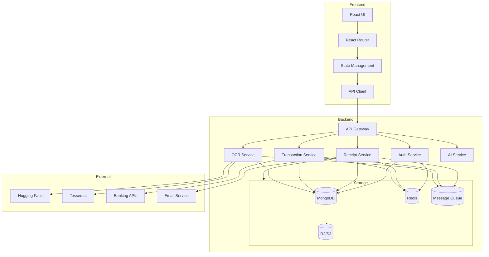
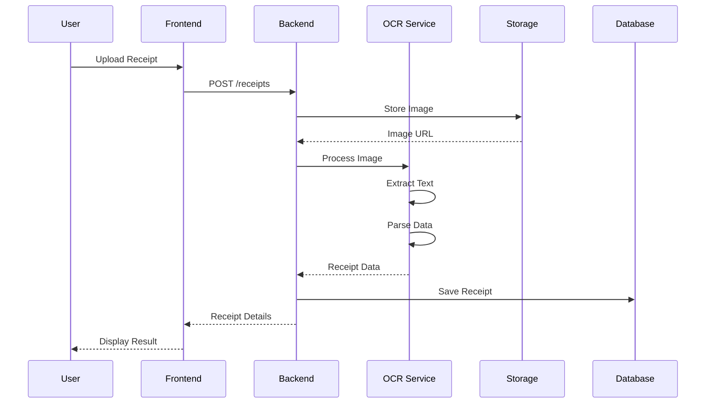
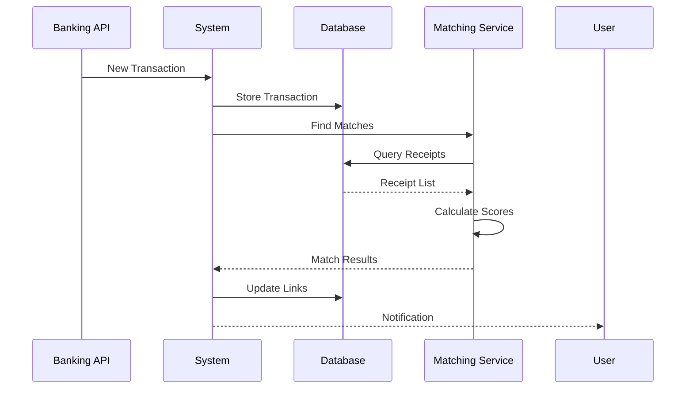

# Technical Architecture

## System Architecture Diagram

## Component Interactions

### Frontend Layer

1. **React UI**

   - Component hierarchy
   - Route management
   - State updates
   - API integration

2. **State Management**

   - Context providers
   - Query caching
   - Local storage
   - Form state

3. **API Client**
   - Request handling
   - Response parsing
   - Error management
   - Authentication

### Backend Layer

1. **API Gateway**

   - Request routing
   - Authentication
   - Rate limiting
   - Request validation

2. **Core Services**

   - Business logic
   - Data processing
   - External integrations
   - Event handling

3. **Support Services**
   - Caching
   - Logging
   - Monitoring
   - Background jobs

### Storage Layer

1. **MongoDB**

   - Document storage
   - Indexing
   - Aggregations
   - Transactions

2. **R2/S3**

   - File storage
   - Image processing
   - CDN integration
   - Backup management

3. **Redis**
   - Caching
   - Session storage
   - Rate limiting
   - Real-time features

### External Integrations

1. **OCR Services**

   - Text extraction
   - Image processing
   - Confidence scoring
   - Error handling

2. **Banking APIs**

   - Account sync
   - Transaction fetch
   - Balance updates
   - Webhook handling

3. **Email Service**
   - Receipt processing
   - Notifications
   - Reports
   - Alerts

## Data Flow

### Receipt Processing Flow

### Transaction Matching Flow

## Scaling Strategy

### Horizontal Scaling

1. **Service Instances**

   - Load balancing
   - Session management
   - Database connections
   - Cache consistency

2. **Storage Scaling**

   - Sharding strategy
   - Replica sets
   - Backup strategy
   - Data migration

3. **Processing Scaling**
   - Worker pools
   - Queue management
   - Resource allocation
   - Error recovery

### Vertical Scaling

1. **Resource Optimization**

   - Memory usage
   - CPU utilization
   - Disk I/O
   - Network bandwidth

2. **Performance Tuning**

   - Query optimization
   - Caching strategy
   - Connection pooling
   - Batch processing

3. **Monitoring & Alerts**
   - Resource metrics
   - Error rates
   - Response times
   - Business metrics
